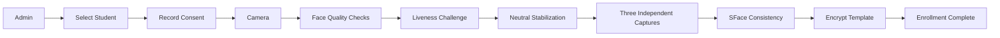
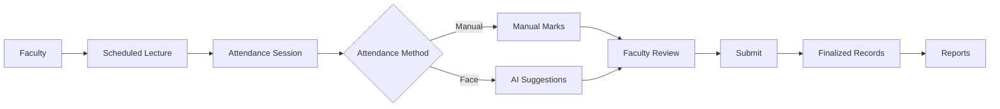
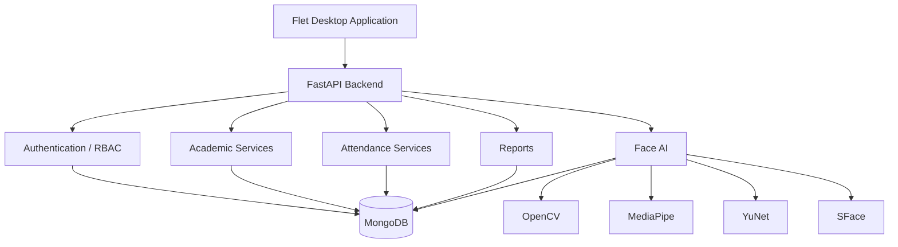

# AI Based Real-Time Face Recognition Attendance System

<p align="center">
  <strong>A Python-based college Major Project combining real-time face recognition, challenge-response liveness, role-based academic management, attendance workflows, and analytics.</strong>
</p>

<p align="center">
  
  
  
  
  
  
  
  
</p>

## Overview

AttendAI is a college Major Project and a Python-based evolution of an earlier web attendance concept. It is not simply a face-detection demo: it brings academic structure, Students and Faculty, timetable scheduling, attendance sessions, manual and AI-assisted attendance, biometric enrollment, liveness checks, and reporting into one integrated application.

The system uses a responsive Flet desktop client, a FastAPI REST backend, and generic MongoDB persistence. AI output remains a suggestion until Faculty review and submission, keeping the official attendance record under human control.

## Application Preview

No public-safe application screenshots are currently stored in this repository. The only images found during the README audit were private enrollment captures under Git-ignored biometric storage; they are intentionally not published or used here.

The following real application views are the recommended capture set. Add them only after confirming that each uses demo data and contains no face image, password, token, database URI, secret, private path, or identifying personal information:

1. Admin Dashboard
2. Face Enrollment Student list, including enrollment status, actions, and privacy notice
3. Faculty Take Attendance or Manual Attendance
4. Reports & Analytics
5. Student Dashboard
6. Academic Management or Timetable

Reserved locations use descriptive filenames under `assets/readme/screenshots/`, such as `admin-dashboard.png`, `face-enrollment.png`, `faculty-attendance.png`, and `reports-analytics.png`. No concept mockup is presented as a real application screenshot.

## Key Features

### Academic Management

- Institution-scoped setup and access
- Academic years, Departments, Programs, and Semesters
- Classes and divisions, Subjects, Students, and Faculty
- Faculty teaching assignments
- Recurring, timezone-aware timetable

### Attendance

- Manual attendance with Present, Absent, Late, and Excused states
- Timetable-backed `AttendanceSession` workflow with roster snapshots
- Faculty review and submission of manual or AI-assisted marks
- Attendance history and controlled administrative corrections
- Finalized attendance as the reporting source of truth

### AI Face Recognition

- OpenCV real-time webcam capture
- YuNet face detection and SFace identity comparison
- Multi-frame, quality-checked face enrollment
- Same-person consistency validation across independent captures
- Roster-scoped matching instead of institution-wide identification
- Normalized, AES-256-GCM-encrypted biometric templates

### Liveness Verification

- MediaPipe Face Landmarker signals
- Adaptive blink calibration
- Randomized challenge sequence
- Blink and head-turn challenges
- Return-to-center verification
- Face continuity, retry, timeout, and multiple-face handling

> **Development-grade challenge-response liveness.** It is not certified anti-spoofing or certified presentation-attack detection.

### Reports & Analytics

- Institution-scoped Admin reports
- Assignment-scoped Faculty reports
- Student self-only reports
- Low-attendance identification
- Subject and attendance-source analytics
- Session-level analytics
- Authorized CSV export

### Phase 13: Requests, Notifications & Audit

- Students can submit a correction request only for their own finalized attendance record; a duplicate pending request for the same session is prevented.
- The assigned Faculty member (or an institution Admin) can approve or reject it. Approval uses an original-status precondition so a later attendance change is never overwritten silently.
- Request submission and resolution generate private in-app notifications. Notifications can only be read or marked by their recipient within the authenticated institution.
- The server records append-only audit events for request creation, cancellation, resolution, and approved attendance corrections. Audit access is Admin-only and metadata is redacted for credentials and biometric fields.

Automated tests cover API contracts, role boundaries, notification privacy routes, audit redaction, and Phase 13 view construction. Manual Student → Faculty → Student verification remains pending.

### Android client (Phase 14)

The Flet client has a responsive Android layout: compact headers, a scrollable public/login shell, drawer navigation, and scrollable workflow pages. The default desktop backend remains `http://127.0.0.1:8000`. On Android, use the Server settings action on the public header to enter a reachable development backend URL; use HTTPS outside deliberately configured local development.

Build development artifacts with the pinned Flet Flutter SDK:

```powershell
.\scripts\build_android.ps1 -Target apk
.\scripts\build_android.ps1 -Target aab
```

The Android client uses the system photo picker for real image bytes sent to the existing authenticated backend face endpoints. Desktop OpenCV preview and Python MediaPipe liveness remain desktop-only; Android live preview/client-side liveness is intentionally not claimed without a supported Flet camera extension.

## Face Enrollment Flow



The preferred public screenshot for this workflow is the Student Face Enrollment list—not a webcam frame—with the caption: **Admin-managed biometric enrollment with encrypted face templates.**

## Attendance Flow



Draft and reopened sessions do not affect official analytics. The finalized percentage is `(Present + Late) / (Present + Late + Absent) × 100`; Excused and unmarked records are excluded from the denominator.

## Architecture



The Flet client does not connect directly to MongoDB. Authorization, biometric matching, template encryption, and reporting policy remain backend responsibilities.

## Face AI Pipeline

| Stage | Responsibility |
| --- | --- |
| OpenCV | Captures webcam frames and prepares image input |
| YuNet | Detects faces and supplies face geometry |
| MediaPipe Face Landmarker | Produces temporal evidence for blink and head-turn liveness challenges |
| SFace | Creates identity embeddings and performs similarity comparison |

SFace is used for identity recognition—not blink detection. Blink and head-turn evidence comes from MediaPipe landmarks over time.

## Security & Privacy

- Argon2id password hashing
- Short-lived JWT access tokens
- Opaque refresh tokens with server-side hashing, rotation, revocation, and reuse handling
- Server-enforced role-based access control
- Institution isolation across academic and attendance data
- AES-256-GCM-encrypted biometric embeddings with contextual authenticated data
- Plaintext embeddings are never returned to the Flet client
- Approved enrollment images remain in private, Git-ignored development storage
- `.env`, logs, captures, exports, model binaries, and biometric data are excluded from Git

> Biometric consent, retention, and deletion policies require formalization before production deployment.

Production use would also require stronger key management, filesystem permissions, monitoring, incident response, security testing, and applicable legal/privacy review.

## Technology Stack

| Layer | Technology |
| --- | --- |
| Language | Python 3.11 |
| Desktop UI | Flet 0.86.5 |
| Backend API | FastAPI 0.141.1 + Uvicorn |
| Database | MongoDB + PyMongo 4.17 |
| Camera | OpenCV 4.13 |
| Face Detection | YuNet |
| Face Recognition | SFace |
| Liveness | MediaPipe Face Landmarker 0.10 |
| Authentication | JWT access tokens + refresh-token rotation |
| Password Security | Argon2id |
| Biometric Encryption | `cryptography` + AES-256-GCM |
| Testing | Pytest + FastAPI TestClient |

## Project Structure

```text
AttendAI-Python/
├── app/
│   ├── components/       # Reusable Flet controls
│   ├── screens/          # Admin, Faculty, Student, and auth views
│   ├── services/         # API, camera, biometric, and liveness clients
│   └── test_*.py         # Flet/client tests
├── backend/
│   ├── app/
│   │   ├── api/          # HTTP endpoints
│   │   ├── core/         # Configuration, security, and errors
│   │   ├── db/           # MongoDB connection and indexes
│   │   └── modules/      # Domain services and repositories
│   └── tests/            # Backend tests
├── scripts/              # Setup, model download, run, and verification tools
├── models/               # Downloaded locally; model binaries are Git-ignored
├── docs/                 # Architecture and milestone documentation
└── assets/
    └── readme/           # Hero, screenshot, and diagram assets
```

## Windows Installation

Prerequisites: Python 3.11, Git, MongoDB Community Server or another authorized MongoDB deployment, and a supported webcam for biometric workflows.

```powershell
git clone https://github.com/Faizzsyed/ai-based-real-time-face-recognition-attendance-system.git
cd ai-based-real-time-face-recognition-attendance-system

python -m venv .venv
.\.venv\Scripts\Activate.ps1

pip install -r backend\requirements.txt
pip install -r app\requirements.txt

Copy-Item .env.example .env
python scripts\download_face_models.py
```

Configure the new development database and independent random secrets in the local `.env`. Never commit that file. The model downloader obtains checksum-pinned YuNet, SFace, and MediaPipe assets and verifies their size and SHA-256 digest.

Start the backend in one PowerShell terminal:

```powershell
.\scripts\run_backend.ps1
```

Start the desktop application in another:

```powershell
.\scripts\run_app.ps1
```

## Initial Admin Setup

The first Institution and Admin are created with an interactive, guarded bootstrap script:

```powershell
.\.venv\Scripts\python.exe .\scripts\bootstrap_institution_admin.py
```

The script displays the target database, refuses known legacy database names, validates the IANA timezone, securely prompts for a password without echoing it, and requires the exact confirmation `YES`. It does not provide or publish default credentials and is never run automatically.

## Testing

Run the complete compile, backend, import, and Flet/client verification workflow:

```powershell
.\scripts\verify_project.ps1
```

### Phase 12 milestone snapshot

| Suite | Result |
| --- | ---: |
| Backend | 163 passed |
| Flet/client | 98 passed |
| **Total** | **261 passed** |
| Failures | 0 |

This is a milestone snapshot, not a permanently current badge and not a claim about face-recognition accuracy.

## Project Status

### Verified through Phase 12

- Real local MongoDB operation
- Admin authentication
- Manual attendance workflow
- Real-webcam enrollment of the designated development test Student
- Encrypted enrollment storage
- Reports and analytics
- Backend and Flet/client automated suites

### Pending final real-world validation

- Enrollment of a second physically different person
- Unknown-person rejection
- Wrong-person 1:1 verification
- Printed-photo and replay testing for Phase 11 liveness
- Android APK/AAB packaging
- Deployment and production hardening

## Current Limitations

- Liveness is development-grade and is not ISO/IEC 30107-certified presentation-attack detection.
- The project does not claim resistance to sophisticated replay, deepfake, injection, or 3D-mask attacks.
- Final multi-person and negative-case biometric validation remains pending as listed above.
- PDF reporting is deferred; authorized CSV export is implemented.
- No production-readiness or 100% recognition-accuracy claim is made.

## Roadmap

- **Completed:** Phases 0–12
- **Phase 13:** Requests, Notifications & Audit
- **Phase 14:** Android APK/AAB
- **Phase 15:** Web & Deployment Readiness
- **Phase 16:** Final Hardening & Release

## Major Project

This system is being developed as a college Major Project focused on combining computer vision, secure academic workflows, and attendance management in one integrated Python application.

## Documentation

Detailed design and verification notes are available under [`docs/`](docs/), covering architecture, authentication, academic management, attendance, biometric workflows, liveness, performance, reports, and manual test plans.

## Author

**Faiz Sayyed**

- GitHub: [github.com/Faizzsyed](https://github.com/Faizzsyed)
- LinkedIn: [linkedin.com/in/faizsayyed-tech](https://linkedin.com/in/faizsayyed-tech)

## License

No open-source license has been selected. All rights remain with the project owner unless a license is added later.
