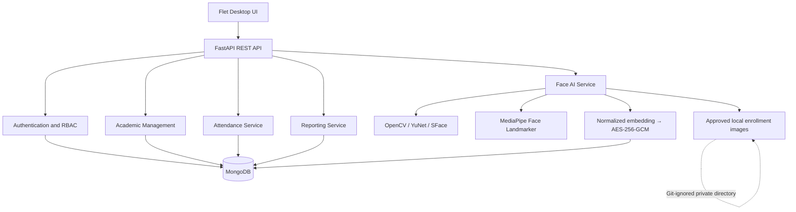

# AI Based Real-Time Face Recognition Attendance System

A Python-based academic attendance management system combining real-time face recognition, challenge-response liveness, role-based academic workflows, and attendance analytics.

## Overview

This college Major Project is a Python-based rebuild and evolution of an earlier web attendance concept. It uses a Flet desktop client, a FastAPI REST backend, and MongoDB persistence. The application covers institution-scoped academic setup, timetable-driven attendance, Faculty-reviewed AI suggestions, encrypted biometric enrollment, and role-specific reporting.

The project is designed as an educational system and portfolio implementation. Its liveness controls are development-grade and are not certified presentation-attack detection.

## Key features

### Academic management

- Institution and academic-year configuration
- Departments, programs, semesters, classes/divisions, and subjects
- Student and Faculty account management
- Faculty teaching assignments
- Recurring, timezone-aware timetable

### Attendance

- Timetable-backed attendance sessions with immutable roster snapshots
- Manual marking with Present, Absent, Late, and Excused states
- AI-assisted face attendance suggestions
- Faculty review before submission
- Draft, submitted, reopened, and locked lifecycle
- Finalized attendance history and administrative correction controls

### Face recognition

- Integrated OpenCV webcam preview
- YuNet face detection and SFace recognition
- Three independent, quality-checked enrollment captures
- Same-person consistency validation
- Normalized, AES-256-GCM-encrypted face templates
- Roster-scoped identification instead of institution-wide matching
- Specific Student 1:1 verification and roster-scoped 1:N identification

### Liveness

- MediaPipe Face Landmarker signals
- Session-calibrated adaptive blink detection
- Randomized, ordered blink/head-turn challenge-response
- Left/right turn and return-to-center checks
- Face continuity, timeout, retry, and multiple-face handling

> **Development-grade liveness; not certified presentation-attack detection.**

### Reports and analytics

- Institution-scoped Admin overview and drill-downs
- Assignment-scoped Faculty reports
- Student self-only attendance analytics
- Finalized-session-only percentages
- Subject and source analytics
- Low-attendance detection and searchable pagination
- Safe CSV exports for authorized report scopes

### Security

- Argon2id password hashing
- Short-lived JWT access tokens
- Opaque, rotating, revocable refresh sessions
- Server-side RBAC and institution isolation
- Backend-authorized Faculty and Student report scope
- AES-256-GCM biometric-template encryption with tenant/student-bound authenticated data
- No plaintext face embeddings exposed to the Flet client
- Private enrollment images and environment files excluded from Git

## Technology stack

| Layer | Technology |
| --- | --- |
| Language | Python 3.11 |
| Desktop UI | Flet 0.86.5 |
| API | FastAPI 0.141.1, Uvicorn |
| Database | MongoDB, PyMongo 4.17 |
| Face pipeline | OpenCV 4.13, YuNet, SFace |
| Landmark/liveness | MediaPipe 0.10 |
| Authentication | PyJWT, Argon2id |
| Encryption | `cryptography`, AES-256-GCM |
| Testing | Pytest, FastAPI TestClient |

## System architecture



The client never connects directly to MongoDB. Biometric matching, encryption, authorization, and reporting policy remain backend responsibilities.

## Attendance workflow

```text
Faculty → Scheduled lecture → Attendance Session
        → Manual marking or Face Attendance
        → AI suggestions where applicable
        → Faculty review → Submit
        → Finalized attendance → Reports
```

Draft and reopened sessions do not affect official analytics. The centralized official percentage is:

```text
(Present + Late) / (Present + Late + Absent) × 100
```

Excused and unmarked records are excluded from the denominator.

## Face enrollment workflow

```text
Admin → Select Student → Record consent → Camera
      → Face quality → Liveness → Neutral stability
      → Three independent captures → Same-person consistency
      → Normalized SFace template → Encryption → Enrollment
```

Raw biometric samples are not included in this repository.

## Face attendance workflow

```text
Faculty → Real Attendance Session → Roster-scoped candidates
        → Liveness → SFace comparison
        → AI Suggested Present → Faculty review → Submit
```

Specific Student mode performs 1:1 verification. All Students mode performs 1:N identification only against the active session roster.

## Windows local setup

Prerequisites: Python 3.11, MongoDB Community Server or an authorized MongoDB deployment, Git, and a supported webcam for biometric workflows.

```powershell
git clone https://github.com/Faizzsyed/ai-based-real-time-face-recognition-attendance-system.git
cd ai-based-real-time-face-recognition-attendance-system

py -3.11 -m venv .venv
.\.venv\Scripts\Activate.ps1

pip install -r backend\requirements.txt
pip install -r app\requirements.txt

Copy-Item .env.example .env
python scripts\download_face_models.py
```

Edit `.env` locally before starting the application. Generate independent random values for `JWT_SECRET` (at least 32 bytes) and `FACE_EMBEDDING_ENCRYPTION_KEY` (exactly 32 bytes or its valid encoded representation). Never commit `.env`.

Start the backend in one PowerShell terminal:

```powershell
.\scripts\run_backend.ps1
```

Start the Flet desktop client in another:

```powershell
.\scripts\run_app.ps1
```

## MongoDB and first Admin

Configure the new development database only through environment variables:

```text
MONGODB_URI=mongodb://127.0.0.1:27017/
MONGODB_DATABASE=attendai_python_dev
```

The bootstrap script is interactive: it shows the target database, validates an IANA timezone, asks the operator to choose credentials locally, and requires the exact confirmation `YES`.

```powershell
.\.venv\Scripts\python.exe .\scripts\bootstrap_institution_admin.py
```

It refuses known legacy database names and is never run automatically. No default Admin password is provided.

## Face model setup

YuNet, SFace, and MediaPipe model assets are generated/downloaded dependencies and are intentionally not tracked. Download them from their official upstream locations through the checksum-pinned helper:

```powershell
python scripts\download_face_models.py
```

The script verifies file size and SHA-256 before accepting each model. Existing local model files are not removed by Git setup.

## Testing

Run the complete compile, backend, import, and Flet regression suite:

```powershell
.\scripts\verify_project.ps1
```

At the Phase 12 GitHub milestone, the local automated suite contained **261 passing tests** with zero failures. This is a milestone-specific checkpoint, not a permanent badge or accuracy claim.

## Screenshots

The repository reserves [`assets/screenshots/`](assets/screenshots/) for public-safe UI screenshots. Screenshots containing passwords, tokens, database configuration, private face images, or identifiable biometric data are intentionally not included. Suitable screenshots may be added later after explicit privacy review.

## Privacy and biometric data

- Face embeddings are normalized and encrypted before database storage.
- Plaintext embeddings and encryption keys are not exposed to Flet.
- Approved enrollment photos are local/private development data under `data/face_enrollments/`.
- Environment files, biometric images, logs, captures, exports, and model binaries are Git-ignored.
- Production deployment requires finalized consent, retention, deletion, filesystem-permission, key-management, and incident-response policies.

## Current limitations

- Phase 11 liveness is development-grade and not ISO/IEC 30107 certified.
- The project does not claim to defeat sophisticated replay, deepfake, injection, or 3D-mask attacks.
- Final second-person, wrong-person, and unknown-person real-world biometric verification remains pending.
- PDF reporting is deferred; authorized CSV export is implemented.
- Android APK/AAB packaging and deployment remain future work.
- Production deployment, load, security, and multi-institution hardening remain future work.
- No 100% recognition-accuracy claim is made.

## Roadmap

Completed milestones:

- Foundation and responsive role-based UI
- Academic architecture and authentication
- Academic, Student, and Faculty management
- Timetable and manual attendance
- Face enrollment and roster-scoped face attendance
- Development liveness hardening
- Reports and analytics

Upcoming:

- **Phase 13:** Requests, notifications, and audit experience
- **Phase 14:** Android APK/AAB packaging
- **Phase 15:** Web and deployment readiness
- **Phase 16:** Final hardening, load testing, multi-institution verification, and release preparation

## Documentation

Detailed technical notes are available under [`docs/`](docs/), including architecture, authentication, academic management, attendance, biometric workflows, performance, liveness, reports, and manual verification plans.

## License

No open-source license has been selected yet. All rights remain with the project owner unless a license is added later.
